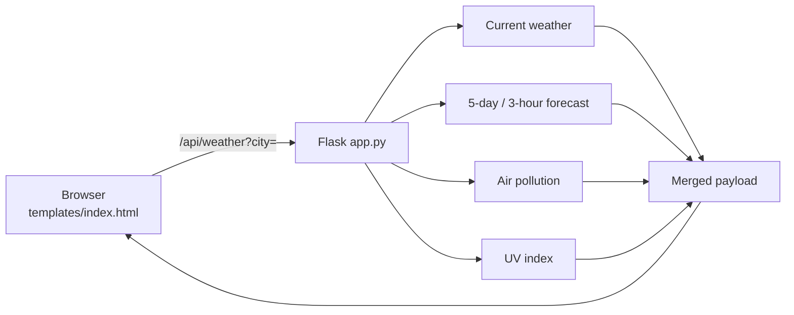

<div align="center">

# SkyCast

**One screen of weather: conditions, forecast, UV and air quality for any city.**

A small Flask app over OpenWeatherMap, with an animated sky canvas and a JSON endpoint

<br />

   

<br />

**[Run it](#run-it)** &nbsp;·&nbsp; **[Features](#features)** &nbsp;·&nbsp; **[Architecture](#architecture)** &nbsp;·&nbsp; **[Installation](#installation)** &nbsp;·&nbsp; **[Limitations](#limitations)**

</div>

---

SkyCast takes a city name and shows what matters on one screen, without ads or clutter. A Flask backend calls several OpenWeatherMap endpoints, merges them into one payload, and a single-page front end renders it over an animated sky canvas.

## Run it

You need a free [OpenWeatherMap API key](https://openweathermap.org/api).

```bash
git clone https://github.com/Samudra-GITHub/SkyCast-Weather-App.git
cd SkyCast-Weather-App && python -m venv .venv && .venv\Scripts\activate && pip install -r requirements.txt
export OPENWEATHER_API_KEY=your_key_here      # PowerShell: $env:OPENWEATHER_API_KEY="your_key_here"
python app.py                                 # http://127.0.0.1:5000
```

Type a city into the search box. The page calls `/api/weather?city=<name>` and renders the result.

## Features

<table>
  <tr>
    <td width="50%" valign="top">
      <h3>Current conditions</h3>
      <p>Temperature with feels-like and min/max, humidity, pressure, visibility, wind, sunrise and sunset, a day/night flag, and an approximate dew point.</p>
    </td>
    <td width="50%" valign="top">
      <h3>Hourly and daily forecast</h3>
      <p>The next 12 three-hour slots (about 36 hours), and up to 7 days of min/max, description and chance of precipitation, derived from the 5-day / 3-hour forecast.</p>
    </td>
  </tr>
  <tr>
    <td width="50%" valign="top">
      <h3>UV and air quality</h3>
      <p>The UV index and the air quality index (1 to 5) for the searched location.</p>
    </td>
    <td width="50%" valign="top">
      <h3>A sky that moves</h3>
      <p>An animated canvas behind the data, with <code>prefers-reduced-motion</code> handled in the stylesheet.</p>
    </td>
  </tr>
</table>

**Also:** a JSON endpoint, `/api/weather?city=...`, used by the page for searches; a clear 503 error if the API key is not configured.

## Tech stack

| Layer | Technology |
| :-- | :-- |
| Backend | Python, Flask, `requests` |
| Frontend | One HTML template with inline CSS and vanilla JavaScript |
| Data | [OpenWeatherMap](https://openweathermap.org/api): current weather, 5-day / 3-hour forecast, air pollution and UV index |
| Serving | Gunicorn (listed in `requirements.txt`) |

## Architecture



`fetch_weather(city)` makes the four calls, using the coordinates and timezone from the first to query the others, and merges them into one response with `current`, `hourly` and `daily` sections.

| Route | Method | Purpose |
| :-- | :-- | :-- |
| `/` | GET, POST | Serves the page; a POSTed `city` is rendered server-side |
| `/api/weather` | GET | JSON weather for `?city=`. 400 if missing, 404 if not found, 503 if the API key is not configured |

```text
SkyCast-Weather-App/
├── app.py              Flask app: routes and OpenWeatherMap integration
├── templates/
│   └── index.html      The whole front end: markup, styles and scripts
├── requirements.txt    Flask, requests, gunicorn
└── .env.example        Environment variable template
```

## Installation

Requires Python 3.

```bash
python -m venv .venv
.venv\Scripts\activate          # macOS/Linux: source .venv/bin/activate
pip install -r requirements.txt
```

### Environment

| Variable | Required | Purpose |
| :-- | :-- | :-- |
| `OPENWEATHER_API_KEY` | Yes | Your OpenWeatherMap API key |

There is no fallback key, and the app does not load `.env` itself: export the variable in your shell (`.env.example` is a template, and `.env` is git-ignored). Never commit a real key.

### Deploy

No deployment configuration is included. Gunicorn is in `requirements.txt`, so a typical setup is `gunicorn app:app` with `OPENWEATHER_API_KEY` set on the host.

## Limitations

- No screenshots yet: the app needs a live OpenWeatherMap key to show real data, and none is committed.
- No automated tests, and no location autocomplete or saved cities.

## License

[MIT](LICENSE).
